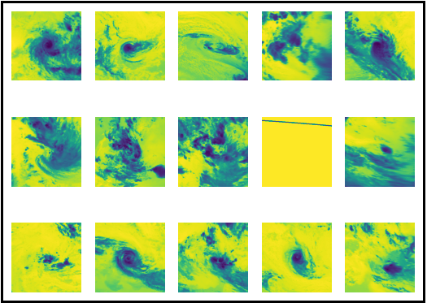
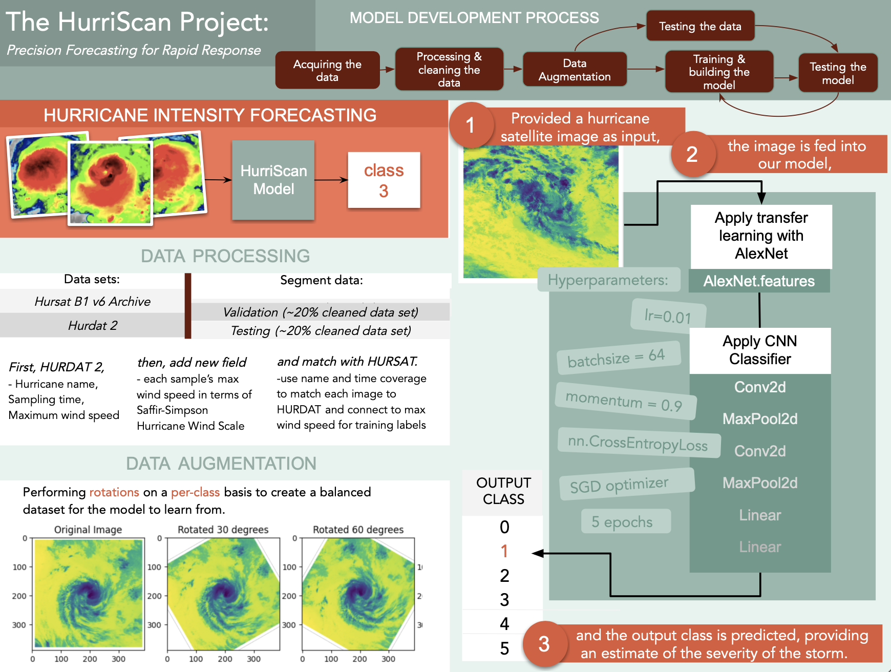
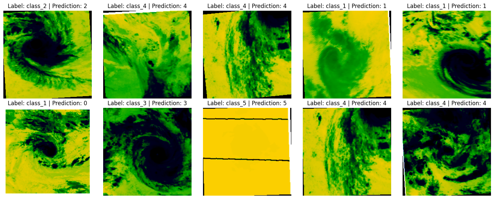
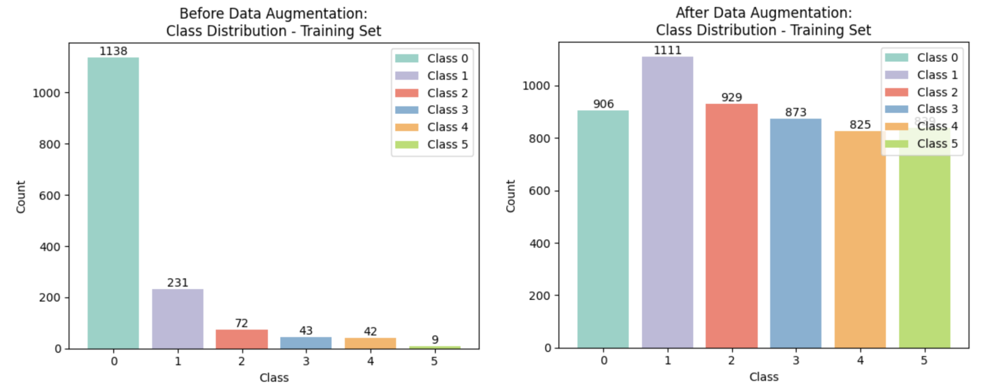
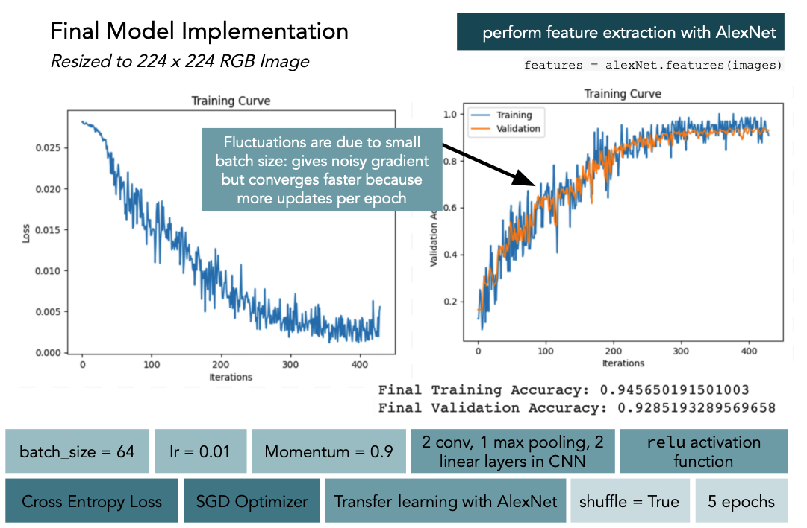

<h1 align="center"> The HurriScan Project </h1>
<!-- 
 By Claire Dimitriuc, Charlotte Fritz, Thardchi Ganesalingam & Sean Pourgoutzidis 
 -->

  <!---->
  

 By Claire Dimitriuc, Charlotte Fritz, Thardchi Ganesalingam & Sean Pourgoutzidis 

  <!---->

## Description

The HurriScan Project is a PyTorch-based deep learning model, developed as a tool for hurricane intensity forecasting. By providing accurate and timely hurricane forecasting predictions, the project aims to mitigate the devastating impact of hurricanes on human lives. This project was developed by Thardchi Ganesalingam, Charlotte Fritz, Claire Dimitriuc, & Sean Pourgoutzidis for the Introduction to Machine Learning Course (APS360) at the University of Toronto.

  <!---->
  

## Data Collection & Augmentation

Our data was obtained by aggregating the HURSAT and HURDAT 2 datasets. This was accomplished by obtaining each storm's name, time, and maximum windspeed from the HURDAT 2 dataset and name, time, and satellite image from the HURSAT dataset. Storms where the name and time matched then had their satellite image paired with their intensity (derived from its maximum windspeed) to form our training data. See a sample of the data below:

  <!---->
  

Unfortunately, after obtaining our data we found we only had ~2500 images where the majority of the samples were from class 0 hurricanes. To rectify this, our team augmented lower-represented classes by rotating the images to ensure the data was balanced and with ample samples. Our final class distribution after data augmentation can be seen below:

  <!---->
  

# Model

Our model was built upon the AlexNet network due to its established ability to recognize high-level features in image data. On top of this, our team trained our own convolutional layers and classifier on top of the embeddings produced by AlexNet to specialize to our specific problem. 

  <!---->
  

 

## Results and Further Information

For information on our results and further explanation of the project, please check out our [official report](https://drive.google.com/file/d/1k8KF6Ui9yT2awSPM993zoFm_6jhEKOsA/view?usp=sharing) and our [video presentation](https://drive.google.com/file/d/19rEmTvcj-dvJqhJ7uodOpZdjCWpxrR81/view?usp=drive_link)!
